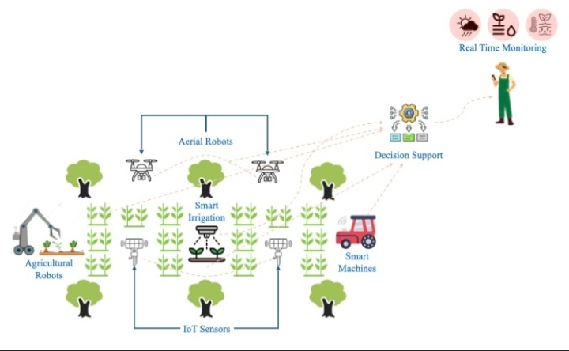
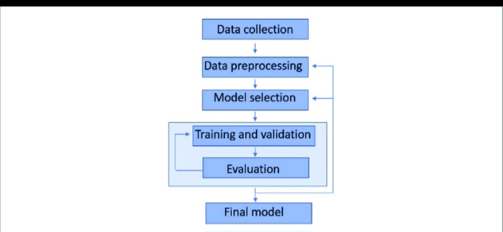

# 🌾 AGROVOTE

### A Hybrid IoT and Machine Learning Approach for Crop Recommendation  
### Using a Voting Ensemble Model

---

## 📌 About the Project

AgroVote is a smart agriculture decision-support system designed to
recommend the most suitable crop based on soil and environmental
conditions. The system integrates **IoT-based data collection** with
**machine learning ensemble techniques** to improve the accuracy and
reliability of crop recommendations.

The project focuses on practical implementation by combining real-world
parameters such as soil nutrients and weather conditions with data-driven
machine learning models.

---

## 🧠 System Block Diagram


### Description

The system block diagram illustrates how the following input parameters
are collected and processed:

- Nitrogen (N), Phosphorus (P), Potassium (K)
- Temperature
- Humidity
- Rainfall
- Soil pH

These parameters are analyzed using a **Voting Ensemble Machine Learning
Model** to recommend the most suitable crop for cultivation.

---

## 🔁 System Workflow





### Workflow Steps

1. Collection of soil and environmental data  
2. Data preprocessing and normalization  
3. Feature extraction  
4. Prediction using multiple machine learning models  
5. Decision making using voting ensemble logic  
6. Final crop recommendation  

---

## 🤖 Machine Learning Model


### Models Used

- Decision Tree  
- Naive Bayes  
- Random Forest  

The outputs of individual models are combined using a **Hard Voting
Ensemble Classifier**, where the final prediction is selected based on
majority voting. This approach reduces bias and improves prediction
stability compared to single-model systems.

---

## 🔌 Sensors and Hardware


### Hardware Components

- ESP32 / NodeMCU  
- Soil Moisture Sensor  
- DHT11 / DHT22 (Temperature & Humidity)  
- Soil pH Sensor (optional)  
- Jumper Wires  
- Breadboard  
- Power Supply  

The sensors collect real-time environmental and soil data which can be
transmitted to the backend system for analysis.

---

## 📊 Sample Output / Demo


This section shows a sample visualization of crop recommendation results
and environmental insights.  
*(Prototype / demonstration purpose)*

---

## 🧩 Technologies Used

- Python  
- Flask  
- Scikit-learn  
- Pandas  
- NumPy  
- Arduino IDE  
- ESP32  

---

🌱 Applications
●Smart Agriculture
●Precision Farming
●Crop Planning Support
●Academic and Research Projects

---
## 📁 Project Structure

```text
AgroVote/
├── assets/
│   ├── BLOCK DIAGRAM1.jpg
│   ├── BLOCK DIAGRAM2.jpg
│   ├── WORKFLOW1.jpg
│   ├── WORKFLOW2.jpg
│   ├── MACHINE LEARNING1.jpg
│   ├── MACHINE LEARNING2.jpg
│   ├── MACHINE LEARNING3.jpg
│   ├── SENSORS & HARDWARE1.jpg
│   ├── SENSORS & HARDWARE2.jpg
│   ├── SENSORS & HARDWARE3.jpg
│   ├── Demo output.jpg
│   ├── Demo output1.jpg
│   └── Demo output2.jpg
│
├── iot/
│   └── esp32_sensors.ino
│
├── ml/
│   ├── dataset.csv
│   ├── train_model.py
│   └── model.pkl
│
├── server/
│   └── app.py
│
├── README.md
├── requirements.txt
└── LICENSE


